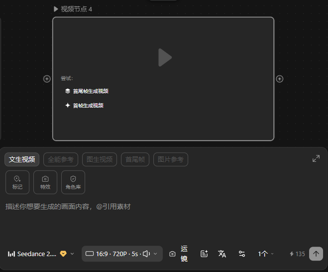

# Qiji 复刻 · Phase 1 画布地基使用说明

<aside>
📦

本页对应 **Phase 1 画布地基**（已打包为 `Qiji.zip` 供下载）。架构决策详见蓝图：[Qiji 复刻 · 系统架构技术选型与开发蓝图](https://app.notion.com/p/Qiji-b0c6abcf777647708bc620c5e2c59c47?pvs=21)。

</aside>

## 这是什么

Qiji 复刻项目的可运行地基：**Vite + React 18 + TypeScript + React Flow + Zustand**。Phase 1 已让五类节点（文本/脚本/图片/视频/音频）真正落地：画布以 Zustand store 为单一数据源，所有变更经 Command Bus（同源指令核心）落库；支持从左侧浮动工具 dock 拖拽生成节点、连线防环落库、节点参数实时可编辑。核心抽象层（单向 DAG 防环、Model Hub 适配、任务轮询、资产 ID、积分账本、错峰调度）已就位，待 Phase 3 接入真实模型。

<aside>
✅

**Phase 1 新增能力**

- 画布 ↔ store 双向打通：节点/连线/运行态全部走扁平 Map + 细粒度 action（CRDT 友好）
- 侧边栏拖拽四类节点到画布即新建（落点坐标精确换算）
- 连线实时 DFS 防环，成环即拒连；删除节点级联清理连线
- 节点表单可编辑（脚本文案 / 图片·视频·音频提示词），变更经命令落库
- 「运行」按钮经命令置运行态，呼吸灯/状态样式联动（执行逻辑待 Phase 3）
</aside>

<aside>
🎨

**v1.3 UI 升级（已套用上传的界面皮肤）**

- 暗色玻璃拟态皮肤：保留 React Flow 引擎，全量引入 Tailwind v4 + shadcn/ui(Radix) + motion + lucide 图标
- 节点对外只展示结果：文本 / 脚本 / 图片 / 视频 / 音频的结果显示恒定，**不随模型变化**
- 新增**文本节点**（创意种子），共五类节点：文本 · 脚本 · 图片 · 视频 · 音频
- **底部上下文操作面板**：选中节点后从底部浮现，随所选模型动态重渲（能力 Tab + 提示词 + 参数 + 预估积分 + 运行），与结果显示互不遮挡、相对固定
- 左侧浮动工具 dock 取代旧侧边栏；另有顶部素材库、右键菜单、底部状态栏
</aside>

## 如何运行

```bash
npm install
npm run dev
```

打开终端提示的本地地址，即可看到画布、左侧边栏与四类节点。其他脚本：`npm run build`(构建)、`npm run typecheck`(类型检查)、`npm run format`(格式化)。

<aside>
⚠️

依赖 `@xyflow/react`、`zustand`、`tailwindcss`、`@radix-ui/*`、`motion`、`lucide-react`、`class-variance-authority` 等需联网 `npm install` 后才能启动；本沙箱未联网，故仅做了解析校验与格式化，未跑安装/类型检查。

</aside>

## 目录结构 → 架构映射

| 路径 | 职责 | 蓝图对应 |
| --- | --- | --- |
| `src/types/index.ts` | 全局类型（Node/Edge/Group/Asset/Project/Runtime/AutoSchedule） | 数据模型 |
| `src/command/` | 统一指令核心：Command Bus + dispatch + 处理器注册（同源 GUI/Copilot/Agent） | 同源双入口之魂 |
| `src/store/canvasStore.ts` | 画布状态：节点/边/分组/运行态，细粒度 action + 参数更新 + 级联删边 | 画布地基 |
| `src/canvas/Canvas.tsx` | store 驱动画布：拖拽落节点 / 连线防环 / 选择 / 拖动落点记账 | 画布地基 |
| `src/nodes/` | 五类节点（只读结果展示）+ BaseNode + ResultView + 注册表 | 画布地基 · 视觉系统 |
| `src/panel/` | 底部上下文操作面板 + 参数控件（schema 驱动，随模型重渲） | 节点交互 |
| `src/components/ui/` | shadcn/ui 组件（button / select / tabs / slider 等） | 视觉系统 |
| `src/styles.css` | 暗色玻璃拟态设计 token + 节点 / 面板皮肤 | 视觉系统 |
| `src/dag/validate.ts` | 单向 DAG 防环（DFS）+ isValidConnection | DAG 约束 |
| `src/services/modelAdapter.ts` | 统一 Model Hub 契约（submit/poll/estimateCost/paramsSchema） | Model Hub |
| `src/services/taskTracker.ts` | 集中式批量轮询（预留 SSE/WS） | 执行与状态 |
| `src/services/assetStore.ts` | 资产 ID 单调递增、永不复用（本地→S3） | 资产管理 |
| `src/services/creditLedger.ts` | 积分预扣 / 结算 / 退回（错峰不打折） | 计费 |
| `src/services/scheduler.ts` | 错峰排期：continuation 串行、独立并行（拓扑分层） | 错峰自动模式 |

## 下一步

Phase 1 画布地基 + v1.3 UI 升级已完成（暗色玻璃皮肤、五类只读结果节点、底部上下文操作面板）。接续推进 **Phase 2 交互富化**（拖线弹菜单 / 中段插入 / 框选打组 / 仅结构撤销重做），随后 **Phase 3 执行与模型接入**（Model Hub 真实适配 + TaskTracker 轮询 + Scheduler 错峰）。

