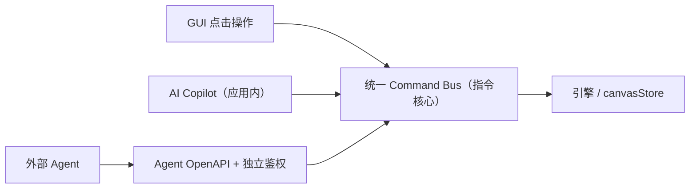
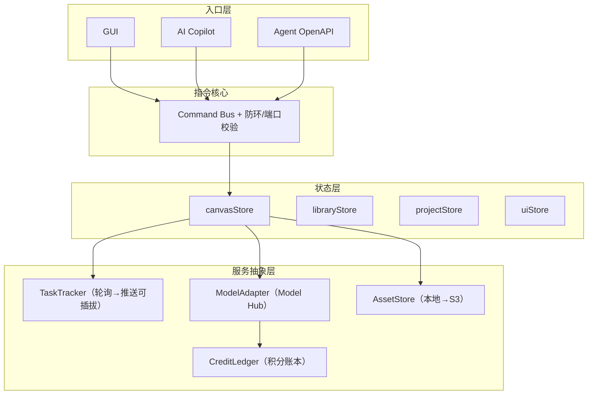
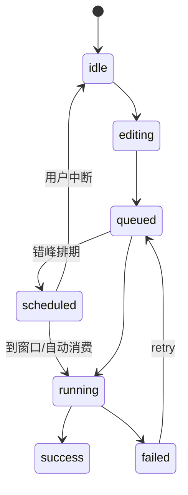

# Qiji 复刻 · 系统架构技术选型与开发蓝图

<aside>
🧭

**项目**：复刻 Qiji —— 企业级「无限画布 + 节点式工作流」AI 创作平台，主战场为**漫剧创作**。

**当前状态**：7 大需求维度已逐一锁定 ✅，本文档为开工前的最终架构基线。

**核心纪律**：选型一旦跑偏即陷「状态地狱」，故所有决策以「解耦 + 可插拔 + 预留后路」为最高准则。

</aside>

<aside>
📝

**评审修订 v1.2** —— 关键裁决已并入下文：

1. **音频节点提前**：漫剧刚需，纳入 Phase 1-2，不再后置。
2. **重新爆破 = 弹窗让用户选**（增量更新 / 整列重建）。
3. **资产 ID 单调递增、永不复用、仅用户可删除**，系统不自动 GC。
4. **Agent 可发生成指令，但须用户批准**；用户可授权一段时间内自动生成。
5. **定时启动 · 错峰自动模式**：用户设自定义启动时间（不限终止）并授权窗口，期间 Agent 进入「只生成、不新建节点」的自动推演，用空闲算力消化长时任务；用户可随时中断、且不阻塞手动操作。
6. **依赖感知排期**：同场景「延续」（借用上一片段作参考）严格按序串行；不同场景批量并行；新增「延续」边类型。
7. **错峰不打折**：仅排队错峰，不影响计价。
</aside>

<aside>
🎨

**UI 集成修订 v1.3** —— 吸收上传的「无限画布应用界面」设计稿（Figma 导出），决策如下：

1. **渲染引擎不变**：继续用 React Flow，仅套用新视觉皮肤（自定义节点 + Tailwind），不改用手写画布。
2. **节点扩到五类**：在 脚本/图片/视频/音频 之外新增**文本节点**（剧情/场景/角色设定的创意种子，可派生文生视频/文生音乐/图片反推提示词）。
3. **UI 技术栈**：全量引入 **Tailwind v4 + shadcn/ui(Radix) + motion/react + lucide-react**。
4. **节点详情交互（重定义）**：节点本体**只展示结果**（图片/视频/文本/脚本，无结果时显示「尝试」快捷建议）；选中后在**画布底部弹出上下文操作面板**（能力 tab + 提示词 + 模型/参数/数量/积分/运行），与结果**互不遮挡、相对固定位置**。详见§十一。
</aside>

## 一、决策总览（7 维度锁定结论）

| 维度 | 主题 | 锁定结论 |
| --- | --- | --- |
| 1 | 执行流转引擎 | 逐节点手动执行 · 下游互不阻塞 · 严格单向 DAG · 脚本一键爆破（核心） |
| 2 | 节点与卡片系统 | 不做脏传播 · 五类节点(文本/脚本/图片/视频/音频)闭环 · 节点只展示结果 + 底部上下文操作面板 · 自由拉伸 |
| 3 | 画布空间交互 | 中段+插入 · 拖线弹新建菜单 · 仅结构撤销 · 框选打组 · 全套导航辅助 |
| 4 | 外部模型与异步 | 轮询先行(可升级推送) · 骨架屏呼吸灯 · 前端无限并发 · 积分计费 · 统一 Model Hub · 错峰排期(Scheduler) |
| 5 | 持久化与协同 | 后端限并发+预扣积分 · 单人优先(预留多人) · 整存+历史回溯 · 本地资产(预留 S3) |
| 6 | 外层 UI 外壳 | Copilot 可铺/改/重排节点 · 左侧素材库+拖入+工具+项目切换+个人中心 · 暂不做 TV Show |
| 7 | Agent 接入(灵魂) | 部分同源(Agent 独立 API) · Skill：会话项目/查进度/批量下载/定时任务/生成(需用户批准，可时限自动授权) · 一项目=一画布 · accessKey 独立鉴权 |

---

## 二、架构脊椎：同源指令核心（Command Core）

整个系统最重要的决策：任何对画布的改动都不直接 `setState`，而是发一条**命令**。GUI、Copilot、Agent 三入口最终都汇聚到同一指令核心——这正是「双入口」得以成立的根基。



<aside>
💡

**部分同源的正确解读**：指令核心(Command Bus + 引擎)是三入口共享的；GUI 与 Copilot 直接调用它；外部 Agent 不直接碰前端，而是经由**自己的 OpenAPI 适配层 + accessKey 鉴权**映射成同样的命令。共享内核、隔离边界。

</aside>

## 三、分层架构



---

## 四、状态管理设计

### 4.1 多 Store 边界隔离

| Store | 职责 | 是否入库 |
| --- | --- | --- |
| canvasStore | 节点 / 连线 / 分组（数据血缘） | 是 |
| canvasStore.runtime | status / 进度 / taskId / 错误 | 否（临时态） |
| libraryStore | 素材库、个人历史资产 | 是 |
| projectStore | 项目 / 会话切换 | 是 |
| uiStore | 面板开合、选中态、悬浮气泡 | 否 |

<aside>
🧬

**CRDT 友好铁律**（为「预留多人」服务，当下零额外成本）：节点/连线一律用**扁平 Map（id 为键）**，所有变更走**细粒度 action**，严禁「整数组替换」式更新。将来包一层 Yjs 即可无痛升级多人协作。

</aside>

### 4.2 节点状态机（每节点独立持有）



UI 区分：`running` = 骨架屏 + 呼吸灯 + 阶段文案（排队/生成中/合成中）；`scheduled` = 显示「将于 HH:mm 启动」+ 倒计时，可随时中断；`failed` = 标红 + 重试按钮。**不做脏传播**，仅在结果里留 `sourceVersion` 字段备用（当前不消费）。

---

## 五、各维度技术落地（详）

- 维度 1 · 执行引擎
    - 无全局调度器；每节点自带「执行」按钮。
    - DAG 用途是**数据血缘**而非执行顺序：连线时在 `isValidConnection` 跑 DFS 防环，成环即拒连并标红。
    - 脚本「爆破」= **fan-out 原子事务**：一次性创建 N 个镜头节点 + N 条连线并自动布局；镜头节点带 `parentScriptId` 以便后续 diff。
    - **重新爆破策略 = 弹窗让用户选**：脚本改动后再次爆破时，弹窗供用户在「增量更新（保住已生成镜头）/ 整列重建」间选择。
- 维度 2 · 节点系统
    - **节点类型注册表**：`component / ioSchema / paramsSchema / adapterKey`；五类节点 **文本/脚本/图片/视频/音频**，新增类型（如视频合成/逻辑节点）只是加配置。
    - **文本节点**为创意种子：承载剧情/场景/角色设定，可派生文生视频/文生音乐/图片反推提示词，作多类节点的上游提示词来源。
    - 端口类型校验：`text.out→script.in`、`script.out(shot)→image.in`、`image.out(frame)→video.in`、`video.out(clip)→audio.in`，叠加防环校验。
    - **节点只展示结果，选中后画布底部弹上下文操作面板**（能力 tab + 提示词 + 模型/参数/数量/积分/运行，由 `paramsSchema` 驱动）；自由拉伸用 `NodeResizer`，`width/height` 入库，图片/视频锁宽高比并设最小尺寸。详见§十一。
- 维度 3 · 画布交互
    - **中段 + 号插入**：自定义 Edge + `EdgeLabelRenderer`；「断旧线 / 插节点 / 补两线」打包成**单条可撤销复合命令**。
    - **拖线到空白弹菜单**：`onConnectEnd` 判定落点为画布空白，记录坐标 → 弹「引用生成」菜单 → 新建节点+补线。
    - **仅结构撤销**：Zustand 历史中间件只追踪结构切片；拖动防抖合并为一条记录；生成结果/参数不入历史。
    - **打组**：父子节点(parentId/subflow)模式；导航全家桶 = MiniMap + 滚轮聚焦缩放 + 对齐参考线 + 网格吸附(默认关，可开关)。
- 维度 4 · 模型与异步
    - **集中式批量轮询管理器**（非每节点各自 setInterval）+ 指数退避；抽象为 `TaskTracker`，升级 SSE/WebSocket 只换实现。
    - **统一 ModelAdapter**：`submit / poll / estimateCost / paramsSchema`，一鱼三吃（节点表单 + 积分预估 + Agent 能力声明）。
    - 前端无限并发的爽感由后端两道闸守住（见维度 5）。
- 维度 5 · 持久化
    - **后端两道闸**：① 并发上限（超出排队，UI 仍显示「排队中」）；② 受理任务时**预扣积分、失败退回**（CreditLedger）。
    - **撤销 vs 版本**两层分离：撤销=会话内结构栈（临时）；历史版本=整图持久化快照（防抖自动存盘 + 手动命名版本，非逐帧 patch）。
    - **AssetStore 抽象**：当前=本地/DB + 缩略图缓存，节点只存 `assetId`；切 S3 只换实现。
    - **资产 ID 生命周期**：全局唯一、单调递增、**永不复用**；系统不自动 GC，**仅用户可删除**——故版本回滚总能取到未被用户删除的旧资产。
- 维度 6 · 外层外壳
    - Copilot 通过 **Command Bus** 铺/改/重排节点，绝不直接 setState。
    - 左侧边栏：素材库 / 拖入变「呈现节点」(引用型节点持 assetId) / 20+ 工具入口 / 项目·会话切换 / 个人中心。
    - TV Show 仅留发布空钩子，当前零工作量。
- 维度 7 · Agent（灵魂）
    - **部分同源**：Agent 经独立 OpenAPI + `accessKey` 鉴权，映射到共享指令核心，与人类登录态隔离并存。
    - **前期 Skill 范围**：创建会话 / 新建·切换项目、查询任务进度、批量下载结果、**定时任务**、**生成指令**。
    - **生成需授权**：Agent 发起生图/生视频须经**用户批准**；用户可**授权一段时间内自动生成**（时限到期自动回收授权）。鉴权与额度走 accessKey + CreditLedger。
    - **错峰自动模式（人机协作）**：用户设自定义启动时间（不限终止）并授权窗口；窗口内 Agent 进入**「只生成、不新建节点」**模式——仅对权限内既有节点、依用户预留的剧本/文案/提示词执行生成，用空闲算力完成长时任务。详见§十。
    - **映射**：一个项目 = 一张画布；会话 = 项目内的一次任务。

---

## 六、数据模型草图

```json
{
  "project":  { "id": "...", "name": "...", "canvasId": "...",
                  "autoSchedule": { "startAt": "ISO", "endAt": null, "mode": "agentAuto", "scopeNodeIds": [], "interruptible": true, "authExpiresAt": "ISO" } },
  "canvas": {
    "nodes": {
      "<nodeId>": {
        "id": "...", "type": "text|script|image|video|audio",
        "x": 0, "y": 0, "w": 320, "h": 200,
        "parentId": null, "parentScriptId": null,
        "data": { "input": {}, "params": {}, "resultAssetId": null, "sourceVersion": 0 }
      }
    },
    "edges": {
      "<edgeId>": { "id": "...", "kind": "dataflow|continuation", "source": "...", "sourcePort": "...", "target": "...", "targetPort": "..." }
    },
    "groups": { "<groupId>": { "id": "...", "childIds": [], "x": 0, "y": 0 } }
  },
  "runtime_NOT_PERSISTED": {
    "<nodeId>": { "status": "idle|scheduled|running|success|failed", "progress": 0, "taskId": null, "scheduledAt": null, "error": null }
  },
  "versionSnapshots": [ { "versionId": "...", "name": "...", "createdAt": "...", "canvasJson": {} } ]
}
```

---

## 七、技术选型表

| 层 | 选型 | 定位 |
| --- | --- | --- |
| 画布/节点引擎 | React Flow (xyflow) | 节点+连线+MiniMap+NodeResizer 一站齐全；外覆自定义皮肤 |
| 状态管理 | Zustand + 历史中间件 | 高频画布态；扁平 Map + 细粒度 action（CRDT 友好） |
| 构建/框架 | Vite + React + TypeScript | 企业级前端基线 |
| UI 组件/样式 | Tailwind v4 + shadcn/ui(Radix) + lucide-react | 深色玻璃拟态设计系统（v1.3） |
| 动效 | motion/react（Framer Motion） | 脉冲环 / 面板进出微交互 |
| 进度通道 | TaskTracker：轮询→SSE/WS | 可插拔，先轮询批量化 |
| 模型聚合 | ModelAdapter（Model Hub） | Seedance/Kling/Wan/Midjourney 收敛为统一契约 |
| 资产 | AssetStore：本地/DB→S3 | 节点只存 assetId |
| 计费 | CreditLedger 预扣/退回 | 受理预扣，失败退回 |
| 协同(预留) | Yjs + WebSocket | 多人 CRDT，后置 |
| Agent | OpenAPI + accessKey | 独立鉴权，映射指令核心 |

---

## 八、分阶段开发路线图

- [ ]  **Phase 0 · 脚手架**：Vite+React+TS、React Flow、Zustand、后端骨架与目录约定。
- [ ]  **Phase 1 · 画布地基**：节点类型注册表、五类节点（文本/脚本/图片/视频/音频）、连线+防环+端口校验、选中态、自由拉伸；节点详情改为底部上下文操作面板（替代 NodeToolbar）。
- [ ]  **Phase 2 · 交互富化（+ UI 皮肤套用）**：中段+插入、拖线弹新建菜单、结构撤销/重做、框选打组、MiniMap/聚焦缩放/参考线/网格吸附；并套用 Qiji 皮肤（设计 token + 浮动工具 dock + 素材面板 + 右键菜单 + 底部上下文操作面板）。详见§十一。
- [ ]  **Phase 3 · 执行与模型**：Command Bus、ModelAdapter 适配层、TaskTracker 批量轮询、骨架屏呼吸灯、后端并发闸 + 积分预扣、Scheduler 排期闸（scheduled 态）。
- [ ]  **Phase 4 · 持久化**：CRDT 友好 store 落地、整存 + 快照版本回溯、AssetStore 本地+缩略图。
- [ ]  **Phase 5 · 脚本爆破（核心卖点）**：fan-out 原子事务 + 自动布局 + parentScriptId diff + 重新爆破弹窗（增量/重建）。
- [ ]  **Phase 6 · 外壳**：左侧边栏（素材库/拖入/工具/项目切换/个人中心）、Copilot 接入 Command Bus。
- [ ]  **Phase 7 · Agent OpenAPI**：accessKey 独立鉴权、会话+项目模型、进度查询、批量下载、定时任务、生成指令（需用户批准 / 可时限自动授权）、**错峰自动模式（只生成不新建 + 依赖感知排期 + 延续边 + 随时中断）**。

## 九、预留钩子（当下不写，只留位）

- 多人实时协作（Yjs 包裹 store）
- 对象存储 S3（AssetStore 换实现）
- SSE/WebSocket 推送（TaskTracker 换实现）
- TV Show 发布 / 分享 / 创作过程回放
- 条件逻辑 / 后期剪辑、视频合成节点（注册表加配置）
- 节点脏传播提示（消费 sourceVersion 字段）

---

## 十、定时启动 · 错峰自动模式（人机协作）

把维度 7 的「定时任务」落到错峰生产场景，本质是给执行调度加一道**排期闸**。

### 10.1 工作模式

- **用户侧**：白天搭拓扑、铺剧本/文案/提示词；设定**自定义启动时间**（不限终止时间）并授权一个错峰窗口。
- **Agent 侧（自动模式）**：窗口内对**权限范围内的既有节点**自动推演生成，**只生成、不新建节点**；利用空闲算力消化长时任务（如视频生成）。
- **协作与中断**：用户可**随时中断**；Agent 自动模式后台运行，**不阻塞**用户手动操作。

### 10.2 调度闸链

`scheduled（已排期/等待窗口）` → 到窗口释放进并发队列 → CreditLedger 预扣 → 跑。与维度 5 的并发闸、计费闸串接成一条链。

### 10.3 依赖感知排期

| 场景 | 排期策略 |
| --- | --- |
| 同场景「延续」（借用上一片段作参考） | 严格按 DAG 拓扑序**串行**，前序完成才衔接后序 |
| 不同场景（互不依赖） | **批量并行**（受后端并发闸约束） |
- 新增 **「延续(continuation)」边类型**：标记「把上一节点产物当作参考输入」，构成强排序依赖，喂给 Scheduler 做拓扑排序。

### 10.4 安全边界

- 自动模式命令白名单 = **仅生成类命令**（`run`），禁止 `addNode/connect/delete` 等结构命令——把 Agent 自动行为牢牢限制在「执行既有图」。
- 授权时限到期自动回收；中断即停尚未受理的任务（已受理任务按 CreditLedger 规则结算）。
- **错峰不打折**：仅排队错峰，计价不变。

---

## 十一、视觉系统与节点交互（UI 集成 · v1.3）

吸收 Qiji 设计稿，确立统一视觉语言与节点操作范式。**界面是皮、同源指令核心是骨**：只采纳其视觉/布局，逻辑仍走 Command Bus + store + DAG（设计稿本身是 mock 静态，不当地基）。

### 11.1 设计 token（深色玻璃拟态）

| 类别 | 取值 |
| --- | --- |
| 背景 / 卡片 / 边框 | `#0a0b0f` / `#12141a` / `rgba(255,255,255,.07)` |
| 主色 | `#5b8df6`（蓝） |
| 节点类型色 | 脚本 `#f06b6b` · 文本 `#56cfb2` · 图片 `#5b8df6` · 视频 `#f0a05a` · 音频 `#b57bee` |
| 圆角 / 字体 | `0.75rem` · 类型 chip 用等宽字体 |
| 质感 / 动效 | `backdrop-blur` 玻璃拟态 · `motion/react`（选中脉冲环、面板进出） |

### 11.2 布局骨架 → 架构映射

| 界面元素 | 位置 | 接入 |
| --- | --- | --- |
| 浮动工具 dock | 左侧竖向 | uiStore + commandBus（个人中心/消息/添加节点/历史） |
| 素材面板 AssetPanel | 顶部居中·可折叠 | libraryStore / assetStore；导入走上传命令；图像/视频/音频 tab |
| MiniMap | 右上 | React Flow 自带 MiniMap |
| 右键菜单 ContextMenu | 光标处·嵌套 | Phase 2：右键建节点 + 撤销/重做/剪贴板 |
| 底部状态栏 | 底部 | canvasStore + history（节点数/缩放/X-Y/历史） |
| 底部操作面板 | 底部·选中时 | 见 11.3 |

### 11.3 节点交互范式（核心修订）

- **节点本体 = 结果展示位**：有结果即展示（图片缩略 / 视频播放器 / 文本 / 脚本）；**无结果时显示「尝试」快捷建议** + 占位图标。节点保持紧凑，不内嵌大表单。
- **选中节点 → 画布底部上下文操作面板**（dock、相对固定、与结果互不遮挡）：
    - 能力 tab 按类型而异：视频=文生视频/图生视频/首尾帧/全能参考/图片参考；图片=风格/标记/参考；脚本=剧本→分镜/角色→分镜；文本=自由创作/反推提示词/文生音乐。
    - 提示词输入：支持 `@引用素材`。
    - 底部工具条：模型选择器 + 参数（分辨率·画质·时长·比例·运镜·数量）+ **积分预估** + **运行**。
- **schema 驱动**：面板的 tab / 参数 / 积分预估**全部来自 `ModelAdapter.paramsSchema` + `estimateCost`**——底部面板即 Model Hub「一鱼三吃」的渲染器。
- 自由拉伸仍用 React Flow `NodeResizer`，`w/h` 入库。

### 11.4 五类节点与模型绑定（依设计稿校准）

| 节点 | 能力 | 默认模型 | 产物 |
| --- | --- | --- | --- |
| 文本 | 剧情/场景/角色设定种子；文生视频/文生音乐/图片反推提示词 | GVLM 3.1 | 文本 / 提示词 |
| 脚本生成器 | 剧本→分镜脚本 / 角色→分镜脚本 | GVLM 3.1 | 分镜脚本（供爆破） |
| 图片 | 文生图 / 图生图(编辑) · 风格/参考 | Lib Image · Midjourney | 图像 assetId |
| 视频 | 文生视频/图生视频/首尾帧/全能参考 | Seedance 2.0 · Kling 3.0 · Wan 2.6 | 视频 assetId |
| 音频 | 文生音乐 / 配音旁白 | （Model Hub 收敛） | 音频 assetId |
- **端口血缘**：文本.out(text) → [脚本.in](http://脚本.in)；脚本.out(shot) → [图片.in](http://图片.in)；图片.out(frame) → [视频.in](http://视频.in)；视频.out(clip) → [音频.in](http://音频.in) / 合成。文本可作多类节点的提示词上游。